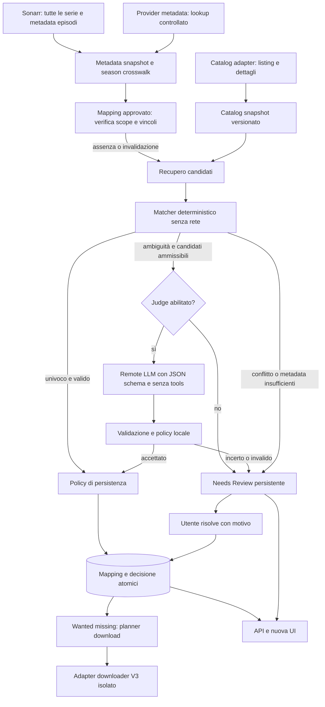

# AniDown V4 — Architettura proposta

Data: 2026-09-14. Stato: proposta da revisionare prima della riscrittura.

## Obiettivo e confini

V4 nasce dal codice effettivo del fork V3, incluse le modifiche locali e i file non tracciati. V3 resta operativa; nessun reset, stash, checkout della sua branch, modifica dell'indice o accesso in scrittura ai dati Docker V3. Questa fase prepara worktree, identità Docker e specifiche; non implementa il matcher, il judge, la nuova persistenza o il frontend.

Assunzioni: app web locale per un singolo amministratore; Python resta il backend; Sonarr resta la fonte della libreria e della numerazione desiderata; AnimeWorld resta il primo adapter di catalogo. Non si assume che una stagione Sonarr corrisponda automaticamente a una stagione editoriale, a un cour o a una pagina del catalogo. I metadati mancanti restano unknown.

## Evidenze della V3

Percorsi relativi al worktree, riferiti allo snapshot del 2026-09-14:

| Codice | Comportamento osservato | Conseguenza V4 |
|---|---|---|
| `src/main.py` | Avvia `Frontend` da `frontend_OLD` e il thread `Core`; l'API alternativa è commentata | Nuovo bootstrap esplicito; nessun import di frontend_OLD nel runtime V4 finale |
| `backend/core/Core.py` | Costruisce DB, connessioni, ricerca, processor, downloader e scheduler nello stesso oggetto | Separare composizione, use case e worker; conservare inizialmente gli adapter |
| `backend/search_v3/variants.py` | Filtra alcuni alias Sonarr per stagione, ma normalizza via ASCII e crea varianti senza sottotitolo/anno/suffisso | Conservare i concetti di alias stagionale; riscrivere normalizzazione e varianti |
| `backend/search_v3/aliases.py::_fetch_jikan_aliases` | Unisce titoli dei primi tre risultati della ricerca Jikan in un elenco globale per titolo | Arricchimento per identità e stagione, con provenienza; mai fondere opere diverse |
| `backend/search_v3/scorer.py` | Exact/contains/fuzzy nello stesso punteggio; non usa anno o episodi nel ranking | Matcher per livelli, vincoli e confronto metadata |
| `backend/search_v3/service.py::filter_candidates_for_season` | Esclude table_seasons incompatibili solo per alcuni matched_field della tabella | Applicare compatibilità stagione a ogni candidato, prima del ranking |
| `backend/search_v3/language.py` | Bonus 0.010 e filtri ONLY prima della selezione | Preferenza audio dopo equivalenza di identità, senza bonus numerico |
| `backend/search_v3/catalog.py` | Indicizza listing e tabella, estrae anno dal testo, presume SUB se unknown nel catalogo | Recupero riusabile; enrich dettagli e mantenimento di unknown |
| `backend/mapping_resolver.py` | Mapping esistente prima della ricerca; chiavi fondate sul titolo; raccoglie alias senza stagione in alcuni passaggi | Conservare priorità del mapping approvato, ma con ID, scope e validazione |
| `backend/mapping_automation.py` | Autosave, draft, backup e controllo URL condivise; parse metadata distinta da wanted/missing | Conservare casi d'uso e protezioni, riscrivere policy e transazioni |
| `frontend_OLD/api.py` | Ricostruisce contesto delle review da una finestra di 600 eventi, altrimenti notes/generic reason | Review come entità persistente, non proiezione di log |
| `frontend_OLD/static/js/index/table.js` | La pagina review dichiara già di conservare le stagioni complete | Conservare questa intenzione e provarla con test backend/API/UI |
| `backend/core/Processor.py` | Il percorso download parte dagli episodi mancanti e può usare il candidato prima che il mapping sia salvato | Separare analisi metadata da download; solo mapping approvati possono produrre job |

Il grafo AST locale ha confermato i collegamenti Core → Processor/Downloader/SearchV3Service/MappingAutomation/MappingResolver. È un aiuto strutturale, non una prova delle semantiche: le conclusioni sopra derivano anche dalla lettura delle funzioni. Il grafo usa ID legacy e non è un deliverable V4.

## Capability map e ordine

| Module id | Responsabilità | Dipende da |
|---|---|---|
| metadata | Identità, titoli tipizzati, season crosswalk, date, episodi, provenienza | — |
| catalog | Raccolta e arricchimento candidati da fonti configurate | metadata |
| matching | Decisione deterministica pura e spiegabile | metadata, catalog snapshot |
| judge | Valutazione opzionale di shortlist ambigue | contratto matching |
| mappings-review | Mapping, vincoli URL, review e risoluzioni atomiche | matching, judge |
| orchestration | Sync, analisi, pianificazione e adapter download | mappings-review |
| api-ui | API versionata e app nuova | use case orchestration e mappings-review |

Ordine: metadata → catalog → matching → mappings-review → judge → orchestration → api-ui. Le interfacce consentono di lasciare judge disabilitato senza cambiare matching. La mappa e queste specifiche sono da revisionare come deliverable della fase richiesta.

## Scelta tecnica

Un monolite modulare Python, un solo processo worker di analisi nella prima versione, niente microservizi o broker obbligatorio. API HTTP versionata `/api/v4`, inizialmente Flask/APIFlask per riuso delle dipendenze effettive; FastAPI è presente nei requirements ma non è il runtime principale osservato, quindi non giustifica da sola una migrazione. SQLite tramite repository e transazioni per la nuova persistenza; JSON rimane formato di import/export e adapter V3 transitorio. Nessuna migrazione DB eseguita ora.

Nuova struttura proposta:

```text
src/v4/
  domain/       # modelli, enum, normalizzazione, vincoli
  matching/     # retrieval keys, evidence, rank, decision
  application/  # sync, analyze, resolve_review, plan_download
  adapters/     # sonarr, animeworld, metadata provider, llm, legacy download
  storage/      # sqlite repositories e migrations versionate
  api/          # DTO, validazione, routes /api/v4
  bootstrap.py  # nessun accesso rete a import-time
frontend-v4/    # app nuova; framework definitivo alla fase frontend
tests/v4/      # fixtures offline, unit, integrazione e contract
docs/v4/       # questi quattro documenti
```

## Data flow



Sync e review non dipendono da wanted/missing. Avere il 100% degli episodi cambia il planner download, non chiude né nasconde una review.

## Modello dati e persistenza

`Series`: id interno, sonarr_instance_id, sonarr_series_id, external_ids e titoli. Un cambio di titolo non crea una nuova serie. `SeasonTarget`: id, series_id, sonarr_season_number, numbering_scheme, release interval e conteggi. `TitleAlias`: testo originale, lingua (en/it/romaji/ja/unknown), tipo, scope (series/season/edition), source_id, timestamp e attendibilità. Scope dei titoli principali esplicito come quello degli alias.

`SeasonCrosswalk`: target Sonarr ↔ release/season/cour del provider, offset/range episodi, provenienza e stato verified/proposed/conflicting. Non confrontare numeri di provider diversi senza crosswalk. `Candidate`: id stabile di catalogo, canonical_url, release identity, titoli, coverage e metadata con provenienza per campo. `Decision`: target_id, snapshot hashes, matcher/policy version, evidence, esclusioni, ordine e outcome. `Mapping`: target_id, candidate_id, ordered_parts, episode_ranges, state e revision. `Review`: target_id, decision_id, reason_codes[], reason_details[], snapshot candidati, state, resolution e timestamps. `JudgeAttempt`: request hash, provider/model/prompt version, response validata, durata, costo stimato ed errore, senza segreti.

Stati review: open → resolved o dismissed con autore e motivazione; nuovo conflitto apre/reapre una review conservando lo storico. Nessuna chiusura implicita da completezza, monitoraggio o rotazione eventi. Decisione, mapping, risoluzione e activity vengono scritti nella stessa transazione; revision optimistic locking impedisce che due azioni sovrascrivano dati.

## Riuso e riscrittura

Riusare con adapter e test: client Sonarr, paginazione wanted/missing, download/ffmpeg e movimentazione file, hook notifiche, whitelist/blacklist e override anime esplicito, backup/import preview, semantica parti ordinate e numerazione assoluta, eventi compatti e scrittura JSON atomica nei bridge transitori, raccolta listing catalogo. Il riuso non implica mantenere coupling o tutti i default.

Riscrivere: normalizzatore multilingua, aggregazione alias, scorer/selector, priorità lingua, risoluzione titolo come identità, persistenza delle review, orchestrazione autosave/download e API V4. Frontend da zero; frontend_OLD resta soltanto nello snapshot iniziale finché il runtime nuovo è pronto, poi viene escluso dall'immagine V4 e rimosso dalla V4 in una fase esplicita. Non viene usato come fondazione o dipendenza della UI nuova.

## Confini operativi

Networking solo negli adapter; timeout, cache e circuit breaker separati. Nessuna rete nel matcher o nei test fixture. Il judge riceve solo metadata pubblici necessari: niente API key, percorsi Plex, header o log integrali. Titoli e ragioni sono dati non fidati e vengono escapati nella UI; le URL scaricabili devono appartenere agli host consentiti e le destinazioni restare nei root autorizzati. Queste sono responsabilità dell'implementazione futura, non hardening eseguito ora.

Configurazione judge avanzata; disabilitato per default. Download V4 e scritture Sonarr disabilitati fino alla fase di guardrail. API della preview su localhost, segreti fuori dal Git, nessun CORS wildcard nel nuovo runtime.

## Verifica e decisioni aperte

Ogni slice implementata dovrà passare test offline, contract API e controllo dei side effect. Stile: dataclass/DTO tipizzati e funzioni piccole senza I/O, per esempio `decision = matcher.decide(target, candidates, policy)`; enum reason codes stabili e dettagli separati dal testo UI.

Da decidere prima delle rispettive fasi: disponibilità reale e precisione dei metadata catalogo; crosswalk verificati dei casi multi-season; framework UI e design direction; attivazione judge/autosave LLM; esportazione della configurazione reale; finestra di abilitazione download. I quattro documenti sono una proposta concreta, non una dichiarazione di funzionalità implementate.

## Foundation implementata

Il contract corrente della foundation offline è [foundation.md](foundation.md). Modelli, normalizzatore, matcher, review snapshot e shadow replay sono implementati in src/v4 come foundation pura. Persistenza, API e frontend hanno ora strati separati descritti nelle sezioni Phase6/7 sotto; judge, downloader e mapping di produzione restano rinviati.


## Phase 3 implementation status

See [phase3.md](phase3.md) for the implemented provenance/crosswalk, policy, isolated review repository and local shadow contracts. This records the Phase3 boundary at its completion. Current runtime/UI status is the Phase7 contract below; LLM remains unimplemented.


## Phase 5 implemented offline contract

See [release-resolver.md](release-resolver.md): N-release/N-season MappingPlan, observed episode coverage, deterministic crosswalk and replay. A Sonarr season is not a catalog release. Runtime orchestration is implemented in Phase6/7; production mapping migration remains deferred.


## Phase 6 application contract

See [frontend-api-contract.md](frontend-api-contract.md): standalone versioned JSON API, DTO-only frontend boundary and V4-local transactional composite review lifecycle. Proposed is distinct from approved. At Phase6 completion the API was unmounted and there was no frontend; Phase7 below supplies the local runtime/UI. Foundation remains unchanged, with no old-review import, LLM or legacy production autosave.


## Phase7 frontend/runtime contract

New frontend-v4 uses HTTP DTOs only and is served same-origin by src.v4.runtime. Runtime API4.1 wraps unchanged foundation/application scan in a durable V4-only asynchronous job, preserving unmounted Phase6 internal4.0 tests. See frontend-api-contract.md, ui-spec.md and frontend-v4/DESIGN.md. local-user is a local audit label, no authentication. At Phase7 completion there was no Docker change; Phase8 binds127.0.0.1:6004 and packages only this runtime and a stable sanitized offline snapshot. No startup scan/import, LLM, downloader or external writes.

The current Phase1 remediation retains loopback as the implicit local boundary but no
longer promotes private peers based on address or Host. Explicit reverse-proxy CIDRs are
configuration, and every non-loopback mutation requires a bearer secret. `local-user`
remains an audit label rather than authenticated user identity.

### Phase 9 judge status

The optional suggestion-only judge is implemented after deterministic matching and release resolution, using an admissible sanitized shortlist. Disabled is the runtime default. Gemini requires environment configuration and is never permitted to approve or persist production mappings. Its attempt/cache records are V4-local and separate from immutable matcher snapshots. See [llm-judge.md](llm-judge.md) for the implemented contract and limits; historical phase-boundary sentences above describe their respective completion dates.

## Phase 3 remediation: current projections and scan lanes

Immutable `v4_items` rows and the event stream remain the audit authority. Schema-versioned,
rebuildable projections now hold the current target/series/season inventory, lightweight item
summaries and item titles. Overview, mapping-list, series-list and activity reads filter, count
and page in SQLite. Series lists contain season summaries only; episode links are loaded from the
immutable current item only for the selected series-detail route. Projection migration is
transactional and idempotent, and never rewrites immutable history.

The live scan has four explicit lanes:

1. **Inventory/diff** reads cheap Sonarr tags and series statistics, fingerprints title,
   numbering, eligibility, audio-policy context and relocated-S0 observations, then compares
   them with the durable current inventory.
2. **Dirty mapping** fetches Sonarr episode detail and indexed catalog shortlists only for new,
   changed or unresolved targets. Shortlists and provider-detail requests are bounded; overflow
   and deferred requests become explicit review/pending reasons.
3. **Provider verification** independently revalidates selected/frozen source URLs under the
   Phase-1 TTL and request budget. A valid frozen group is preserved; invalidation makes it dirty.
4. **Deep audit** is an explicit, durable `deep_audit` scan mode. It refreshes the full provider
   catalog and rematches every eligible target for exhaustive catalog/specials/merged-split
   review. Scheduled and ordinary scans remain `normal` and do not refresh the catalog.

Progress events expose these real stages (`inventory_read`, `inventory_diff`,
`provider_verification`, `dirty_mapping`, and the work-only catalog/candidate/detail/matcher
stages). Normal no-change scans therefore finish after the cheap lanes instead of reading every
episode or rematching every target.

## Post-audit Phase 6 Docker ingress remediation

Real Docker 29.1.3 / Compose 2.40.3 validation showed that publishing a host port from a
container attached only to an `internal: true` bridge was not reachable on the target
host, despite the V4 process listening correctly. The checked-in preview therefore uses
two containers and two networks:

```text
127.0.0.1:6004 -> anidown-v4-loopback -> v4-preview-internal -> anidown-v4:6004
                         |
                  v4-preview-ingress
```

`anidown-v4` has no published port and is attached only to the internal bridge, retaining
the verified no-egress boundary. `anidown-v4-loopback` reuses the same locally built V4
image (whose base is digest-pinned), has no build, pull, volume, secret, or configurable upstream, and
publishes the loopback port from the normal ingress bridge. `gw_priority` explicitly
selects that ingress bridge for portable return routing; it requires Compose 2.33.1 or
newer, and the validated target uses Compose 2.40.3. Both containers run as the image's
UID/GID 10001 with read-only roots, all capabilities dropped, no-new-privileges, bounded
PIDs, `/tmp` tmpfs, and no automatic restart. Downloads, autosync, live Sonarr, judge,
provider verification, and relay remain disabled in the preview.

The sidecar is a bounded raw TCP relay rather than an HTTP forward proxy: it parses no
URLs or headers and can connect only to the compile-time `anidown-v4:6004` destination.
Reads arrive at the application from an explicitly trusted private Docker peer. Mutations
remain fail-closed because the offline preview mounts no authorization-token file.
