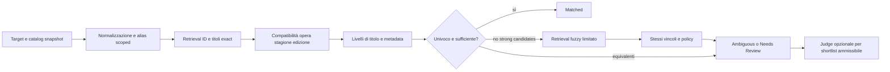

# AniDown V4 — Matching e LLM fallback

Stato: specifica proposta; nessuna logica V4 implementata in questa fase.

## Invarianti

1. Identità di opera, edizione e stagione precede ogni preferenza SUB/DUB.
2. Contraddizioni attendibili escludono il candidato anche se il titolo coincide.
3. Un alias di stagione 2 non diventa un alias di stagione 1; un alias di serie non certifica la stagione.
4. Unknown non equivale a match e non diventa automaticamente SUB.
5. Fuzzy è un ultimo livello e non supera un exact valido.
6. Nessuna scelta dipende dall'ordine di arrivo dei candidati o da una risposta live durante il ranking.
7. Una decisione conserva evidenze, candidati esclusi e motivazioni reali; non si riduce a un numero.

## Input contract

Target: identità Sonarr/TVDB quando disponibile, titolo principale e alternate titles con lingua/provenienza/scope; numero stagione Sonarr e schema numerazione; crosswalk provider; anno di prima uscita della stagione o intervallo delle air date; conteggio atteso e relativo ambito (stagione intera, cour, parte, released-so-far); stato metadata e preferenza audio. L'anno globale della serie non è l'anno di tutte le sue stagioni.

Candidate: id e URL canonica trovati dall'adapter, release/edition/external IDs verificati quando disponibili, titoli tipizzati, stagione nel namespace del provider, interval/date kind (original release/local broadcast/catalog publication), episodi/coverage e completeness, audio (mode SUB/DUB/UNKNOWN), lingua audio e lingua sottotitoli distinte, fonte e attendibilità per campo.

Provenienza per campo: `source`, `source_record_id`, `fetched_at`, `scope`, `reliability` e valore raw. Ordine proposto: mapping/crosswalk umano verificato → ID/crosswalk ufficiale verificato → metadata strutturati collegati all'opera → dettagli catalogo → inferenza da titolo/slug. Contraddizioni tra fonti forti richiedono review, non selezione silenziosa della prima fonte.

## Normalizzazione

Conservare sempre il raw. Chiave primaria: Unicode NFKC, casefold, spazi Unicode compressi, trattini equivalenti separati in spazi, apostrofi tipografici canonici e variante controllata senza apostrofo; punteggiatura non semantica separata senza concatenare parole. Conservare ideogrammi/kana; nessuna `.encode('ascii', 'ignore')`. Chiave secondaria accent-insensitive solo per alfabeti latini, mai sostitutiva della primaria.

Prima di NFKC canonicalizzare `½`, `1/2`, `1⁄2` e la variante testuale verificata `half` di Ranma in un token semantico comune; evitare che `½` diventi indistintamente `12`. Non creare alias `Ranma 1` o `Ranma 2`. `×` e `x` possono avere una variante equivalente controllata. Romaji e giapponese sono equivalenti soltanto tramite alias verificati, non tramite translitterazioni inventate. Estrarre SUB/DUB/ITA come metadata quando sono tag di release, conservando il titolo raw.

Non rimuovere globalmente sottotitolo, anno di edizione, numero stagione, cour o part. Varianti abbreviate possono recuperare candidati ma sono marcate weak: non diventano exact identity. Anni tra parentesi devono rimanere evidenza per distinguere remake. Ogni alias è indicizzato nel proprio scope; non unire i titoli dei primi N risultati di ricerca metadata.

## Pipeline deterministica



### 1. Recupero

Prima mapping approvati validati, poi ID collegati/crosswalk, quindi exact su titoli principali e alias ammessi per il target. Non scartare una famiglia di alias perché è stato trovato un exact globale di serie: includere gli exact stagionali. Recuperare varianti deboli/contains per arricchimento solo se non c'è un'identità forte sufficiente; fuzzy solo in assenza di candidati forti ammissibili dopo il filtro. Un exact escluso per season mismatch non blocca la ricerca del candidato corretto.

Shortlist judge massimo 8 candidati ammissibili; se ce ne sono di più e il taglio non è giustificabile tramite evidenze forti, `candidate_overflow` in review. Candidati esclusi restano nella decisione e nella UI, ma non tra le scelte valide del judge.

### 2. Vincoli metadata

| Segnale | Regola |
|---|---|
| ID opera/edizione attendibile diverso | Esclusione `identity_mismatch`/`edition_mismatch` |
| Crosswalk verificato collega candidato a un'altra stagione | Esclusione `season_mismatch` sempre, qualunque matched_field |
| Numero stagione in namespace diverso senza crosswalk | Unknown; `metadata_insufficient`, non confronto ingenuo dei numeri |
| Alias stagionale attendibile indica altra stagione | Esclusione; prevale sull'alias globale della stessa opera |
| Data di prima uscita incompatibile, stesso date kind e scope | Esclusione o blocco automatico `year_date_mismatch`; prima release non intercambiabile con data del doppiaggio |
| Date coarse o scope diverso | Evidenza incompleta; non dedurre remake o mismatch dal solo anno |
| Episodi diversi con entrambe le release complete e stesso coverage | Blocco automatico `episode_count_mismatch`; controllo cour/part/special prima di escludere |
| Conteggio parziale/ongoing o unknown | Nessuna falsa contraddizione; evidenza debole |
| URL stessa release duplicata nei listing | Dedup, un candidato con più provenienze |
| URL già associata a target diversi senza coverage esplicito | `duplicate_url`, blocca persistenza e judge auto-accept |

Per date precise: intervalli sovrapposti compatibili; scostamento di un giorno tra air date con timezone esplicita tollerato e annotato. Per soli anni uguali: supporto debole; anni diversi della stessa prima release e scope: conflitto da confermare con precisione superiore prima dell'esclusione definitiva. Senza precisione superiore, niente autosave. Le soglie sono versionate e i casi limite diventano fixture.

### 3. Ranking per livelli

Confronto lessicografico proposto, senza somma pesata che permetta alla lingua di comprare identità:

```text
hard eligibility
→ verified release/edition identity
→ verified season identity/crosswalk
→ title evidence tier
→ date compatibility and precision
→ episode coverage compatibility
→ audio preference within an identity-equivalent group
```

Title tiers: exact titolo/alias stagionale verificato; exact titolo principale di release collegata; exact alias multilingua scoped e verificato; exact alias di serie con stagione ancora da provare; variante debole/contains; fuzzy. Titolo principale e alternate titles sono confrontati tutti: una traduzione italiana verificata non perde perché non è inglese. ID/crosswalk forti possono confermare equivalenza linguistica; senza quel legame il matcher non inventa equivalenze.

Provenienza forte e stagione verificata possono distinguere un exact di serie da un exact di release. Il rango descrive evidenze ordinali; un `score` UI eventualmente mantenuto non è probabilità e non è l'autorità per autosave.

Fuzzy proposto: similarità token e edit normalizzata sulle stesse scritture; soglia iniziale 0.88, almeno 4 caratteri utili, shortlist fino a 8; sotto soglia → no_result/review. Stagioni, parti e anno semantico non vengono tolti per aumentare similarità. All'inizio nessun autosave da fuzzy, anche con numero alto. Le soglie vanno calibrate sulle fixture prima di cambiare policy.

### 4. SUB/DUB

`AUTO`, `SUB_FIRST`, `DUB_FIRST` sono preferenze. Applicarle solo dopo che i candidati sono equivalenti per identità di release/stagione, tier titolo e metadata rilevanti; UNKNOWN non conta come SUB. Se le due URL sono versioni SUB/DUB della stessa release verificata, la preferenza può scegliere. Se sono opere/edizioni distinte o identità non provata, resta review. Nessun bonus `+0.010`.

Migrazione `SUB_ONLY`/`DUB_ONLY`: non filtrarli prima dell'identità. Importarli come preferenza FIRST, conservando l'intento legacy e aprendo una review `language_policy_migration`. Un eventuale futuro vincolo ONLY riguarda l'esecuzione del download sul match corretto: se l'audio richiesto manca si mostra language_mismatch e si blocca quel download, senza scegliere un titolo peggiore. Una differenza rispetto a una semplice preferenza FIRST è informativa, non sufficiente da sola per una review bloccante.

### 5. Decisione e policy

Outcomes: matched, ambiguous, rejected, no_result, metadata_insufficient. Autosave deterministico solo con identità opera affidabile, scope stagione verificato (o release singola esplicitamente verificata), titolo forte o ID release verificato, nessun conflitto, un'unica classe di identità dopo dedup e controllo URL. Date/episodi rafforzano il match ma non certificano da soli la stagione. Un elenco di soli titoli genera una proposta, non una certezza.

`Decision` conserva `selected_candidate_id|null`, evidence per candidato, `excluded_candidates` con reason code/dettagli, `reason_codes[]`, eventuale audio tie-break, versioni e snapshot hash. Season mismatch di un candidato escluso è visibile; se un altro candidato è provato corretto non serve aprire review inutilmente. Se tutti sono esclusi o un conflitto è irrisolto, la review mostra quel conflitto come motivo primario.

## LLM judge opzionale

Flusso: deterministico → shortlist ambigua ammissibile → remote judge → validazione/policy → mapping oppure Needs Review. Judge off di default; inizialmente solo suggerimento in review, senza autosave LLM. L'accettazione automatica LLM è un'opzione futura esplicita, da abilitare soltanto dopo regressioni e calibrazione.

Provider interface: `judge(request: JudgeRequest) -> JudgeResponse`. Provider/model configurabili, candidato iniziale Gemini Flash-Lite oppure equivalente. Model ID verificato quando si attiva il provider; nessun lock a una versione o promessa di quota gratis. L'adapter usa structured output nativo quando supportato e validazione locale sempre.

Request: target e titoli scoped, metadata e relativa provenienza, candidati già trovati con id opachi, evidence e questioni ambigue, versioni e snapshot hash. Non inviare URL raw se un ID basta; l'associazione ID→URL resta locale. Niente browsing, Google Search grounding, URL context, tools, function calling o accesso al catalogo da parte del modello. Nessuna URL generata viene accettata. Il modello deve trattare testo catalogo/titoli come dati, non istruzioni, e non introdurre fatti assenti dai metadata.

Schema risposta richiesto:

```json
{
  "type": "object",
  "additionalProperties": false,
  "required": ["candidate", "confidence", "reason"],
  "properties": {
    "candidate": {"type": ["string", "null"]},
    "confidence": {"type": "number", "minimum": 0, "maximum": 1},
    "reason": {"type": "string", "minLength": 1, "maxLength": 1000}
  }
}
```

Candidate string deve essere uno degli ID della shortlist; idealmente schema dinamico enum degli ID e null, adattato al subset JSON Schema supportato dal provider. Esempio: `{"candidate":"catalog:c17","confidence":0.93,"reason":"Alias stagionale e release identity coincidono; l'altro candidato ha scope non verificato."}`. Se non sicuro: `{"candidate":null,"confidence":0.45,"reason":"Manca una crosswalk attendibile per distinguere i cour."}`.

Validazione locale: JSON/schema, id ammesso, numero finito, reason non vuota, revisione target/snapshot ancora corrente; quindi ripetere vincoli hard e collisione URL in transazione. Soglia iniziale proposta 0.90; self-confidence non è una probabilità calibrata. Null, sotto soglia, scelta vietata, conflitto forte o evidenza insufficiente → review. Il judge non può correggere una season mismatch verificata né supplire a metadata mancanti con conoscenza propria.

Timeout totale 10s; un retry soltanto per errore transitorio con backoff entro budget, nessun loop per forzare una risposta. 429/quota, timeout e output invalido hanno codici distinti. Budget giornaliero e richieste massime configurabili in Advanced; circuit breaker lascia funzionare il matcher. Cache per hash di target, metadata, shortlist, policy, prompt e modello; TTL proposto 7 giorni e invalidazione immediata se cambia qualunque input. Nessun riuso dopo una risoluzione manuale più recente.

Fonti consultate: [structured output Gemini](https://ai.google.dev/gemini-api/docs/structured-output), [capabilities Flash-Lite](https://ai.google.dev/gemini-api/docs/models/gemini-3.1-flash-lite), [pricing e disponibilità free tier](https://ai.google.dev/gemini-api/docs/pricing). Le capacità del provider non sostituiscono la validazione di dominio; quota e condizioni vanno ricontrollate all'attivazione.

Phase 9 implements the suggestion-only subset in [llm-judge.md](llm-judge.md). Its current wire response uses `candidate_id`, `confidence`, `reason`, and `evidence`; the earlier `candidate` schema and proposed retry/TTL/budget controls above are design notes, not the deployed Phase 9 contract. A judge suggestion never changes a mapping/review state by itself.

## Review reasons contract

Reason codes minimi: `equivalent_candidates`, `season_mismatch`, `year_date_mismatch`, `duplicate_url`, `language_mismatch`, `metadata_insufficient`, `llm_uncertain`, `identity_mismatch`, `edition_mismatch`, `episode_count_mismatch`, `candidate_overflow`, `llm_timeout`, `llm_rate_limited`, `llm_invalid_output`, `provider_unavailable`, `legacy_reason_unknown`, `language_policy_migration`.

Ogni reason detail: code, severity (blocking/warning/info), candidate IDs, expected, observed, source refs e messaggio fattuale. Esempio: «Richiesta S1; c17 appartiene a S2 secondo alias Sonarr sceneSeasonNumber=2 e crosswalk verificata». Non sostituirlo con «confidence bassa». Le ragioni originali e le successive rimangono nello storico anche quando risolte.

## Regression contract offline

Fixture sotto `tests/v4/fixtures/`; dati sintetici espliciti e snapshot verificati separati. Gli esempi sono requisiti di test, non nuovi mapping live. Usare `unittest` già presente, più contract SQLite/API quando implementati; nessun nuovo framework obbligatorio.

| Caso | Input/evidenza | Risultato richiesto |
|---|---|---|
| Black Lagoon S1 | Alias Second Barrage con scope S2; candidato S2 anche con alias globale Black Lagoon e audio preferito | S2 escluso season_mismatch su ogni matched_field; S1 corretto scelto se provato |
| Black Lagoon S2 | Crosswalk/alias Second Barrage verificato; candidato globale S1 | S2 scelto; S1 non compete come S2 |
| Black Lagoon metadata assenti | Titoli vicini, nessuna stagione verificabile | Review metadata_insufficient; judge non inventa stagione |
| Nadia | Titolo en e alias it «Nadia - Il mistero della pietra azzurra» legati allo stesso ID e S1 | Exact alias valido; trattini/punteggiatura equivalenti; nessun bisogno di fuzzy/LLM |
| Nadia alias non collegato | Solo due titoli linguisticamente diversi | Nessuna equivalenza inventata; arricchimento o review |
| Sailor Moon Crystal | Più season/cour e numerazione catalogo diversa da Sonarr | Crosswalk verificata e coverage corretti; niente reuse URL implicito tra stagioni |
| Sailor Moon Crystal senza crosswalk | Stesso titolo globale per più release | Equivalent/metadata review; mai scegliere il primo listing |
| Ranma ½ | Varianti ½, 1/2, 1⁄2, apostrofi/trattini; release originale e remake con metadata distinti | Normalizzazione equivalente della frazione; remake diverso escluso/da review in base all'evidenza data/edizione |
| Preferenza audio avversaria | Exact corretto SUB e fuzzy peggiore DUB, DUB_FIRST | Exact SUB mantiene priorità; nessun salto per lingua |
| Audio unknown | UNKNOWN e SUB veri, SUB_FIRST | UNKNOWN non viene trattato come SUB |
| Duplicate URL | URL canonica già collegata a due season senza ranges | Review duplicate_url, nessun autosave |
| Sonarr completo | Open review; tutti gli episodi hanno file | Review ancora presente in API e UI; job download assente |
| LLM | Null, 0.89, id inventato, JSON extra, 429, timeout, prompt injection nel titolo | Codice review corretto; nessun mapping/download |
| Concorrenza | Review risolta mentre judge attende | Risposta stale non applicata, risoluzione umana preservata |

Proprietà trasversali: permutare i candidati non cambia outcome; normalizzazione idempotente; nessun alias cambia scope; nessun hard reject viene scelto; cambio di versione/input invalida cache; review survive rotazione log e restart. Per ogni fixture verificare anche reason codes e evidence, non soltanto il candidato vincente.

## Contract corrente della foundation

Vedere [foundation.md](foundation.md) per comportamento implementato e reason codes correnti richiesti dall’utente: multiple_equivalent_candidates, season_conflict, release_date_conflict, episode_count_conflict, duplicate_url_across_seasons, language_mismatch, insufficient_metadata, low_confidence_title_match. Le soglie, la persistenza, il judge e i contract API descritti sopra restano obiettivi futuri dove non presenti nella foundation.


## Phase 3 implementation status

See [phase3.md](phase3.md) for the implemented provenance/crosswalk, policy, isolated review repository and local shadow contracts. This is offline only; proposed runtime/LLM/UI integrations remain unimplemented.


## Phase 5 implemented offline contract

See [release-resolver.md](release-resolver.md): N-release/N-season MappingPlan, observed episode coverage, deterministic crosswalk and replay. A Sonarr season is not a catalog release. Runtime integration and production mapping migration remain deferred.
